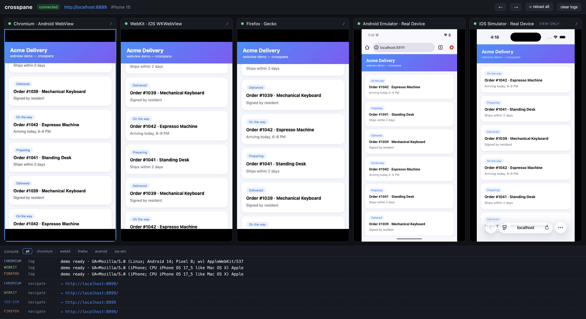

# crosspane

Preview one URL across **Chromium, WebKit, Firefox — and real devices (Android emulator,
iOS Simulator)** — side by side, in a single dashboard.

Point it at your local dev server (`pnpm dev`) and see how your webview screens render
everywhere at once, with mirrored clicks/scrolls/typing and per-engine console, error and
HTTP-failure logs. Built for teams shipping webview-based apps (React Native WebView,
in-app browsers) who need to catch production-environment bugs before deploying.



## Quick start

```bash
# terminal 1 — your app
pnpm dev                 # e.g. localhost:3000

# terminal 2
npx crosspane            # interactive: pick what to run and the port
npx crosspane :3000      # or pass everything directly
# → open http://localhost:7788
```

First run downloads the engine binaries. If a browser is missing, run
`npx playwright install chromium webkit firefox` once.

## Features

- **3 real engines**: not viewport spoofing — actual Chromium/WebKit/Firefox render your page
- **Webview environment emulation (default)**: Chromium runs with a real Android WebView
  UA (`; wv)` token), WebKit runs with a real WKWebView UA (no Safari token) and service
  worker registration blocked — so UA-sniffing app code behaves like production. Pass your
  app's exact UA with `--user-agent`, or opt out with `--preset-ua`
- **Real-device panes (auto-detected)**: with Xcode installed, a REAL iOS Simulator pane
  (Apple's actual iOS WebKit build, real iOS fonts/status bar) is added automatically
  (view-only; follows navigate/reload/sync). With the Android SDK installed, a REAL
  Android emulator pane running actual Android Chrome is added — fully interactive via
  adb (tap/swipe/type/back are mirrored). A USB-connected Android phone works too.
- **Login session persistence**: each engine's cookies/storage are saved on exit and
  restored next run (`~/.crosspane/state/<origin>/`) — log into your app once, not on
  every launch in every engine. Start clean with `--fresh`
- **Runtime pane control**: all available engines are always listed — profiles only
  decide what auto-starts. Boot the real-device panes on demand with ▶, stop any
  engine with ■ to free resources, focus one pane full-width (Esc to exit), and
  navigate every engine from the URL bar
- **Mirrored interaction**: click/scroll on any pane replays on every engine
- **Per-engine console**: `console.*`, uncaught errors (with stack), failed network requests — filterable by engine
- **HMR friendly**: engines are real browsers pointed at your dev server, so hot reload just works
- **Device presets**: any [Playwright device descriptor](https://playwright.dev/docs/emulation#devices) (`--device "iPhone 15"`, `"Pixel 7"`, …)
- **Bridge mocking**: `--inject ./bridge-mock.js` injects a script before page load — mock your app's `window.AppBridge` etc.

## CLI

```
crosspane <url | :port> [options]

--profile <name>     webview (default) | web | device | full
                       webview: Chromium+WebKit — in-app webview engines, fast loop
                       web:     +Firefox — mobile web cross-browsing
                       device:  webview + REAL Android emulator / iOS Simulator
                       full:    everything
--engines <list>     override engine list (chromium,webkit,firefox)
--device <name>      Playwright device preset (default: "iPhone 15")
--port <n>           dashboard port (default: 7788)
--inject <path>      JS injected into every page before load
--user-agent <ua>    exact UA for every engine (reproduce your app's webview UA)
--preset-ua          use Playwright preset UA instead of webview UA emulation
--ios-sim            force the real iOS Simulator pane (auto when Xcode exists)
--no-ios-sim         disable the iOS Simulator pane
--android            force the real Android pane (auto when the Android SDK exists)
--no-android         disable the Android pane
```

## How it works

```
CLI (Node)
 ├─ Playwright: one browser context per engine (device preset + init scripts)
 ├─ HTTP server: serves the dashboard (React) on :7788
 └─ WebSocket:
     server → client   binary frame packets ([engine byte][JPEG]) + JSON events
     client → server   normalized click coords, coalesced scroll deltas → mirrored to all engines
```

Frame streaming is per-engine:

- **Chromium** — CDP screencast: the browser pushes a frame only when the screen
  changes, so idle traffic is zero and interactions render at native frame rates
- **WebKit / Firefox** — no screencast API, so adaptive `page.screenshot()` polling:
  slow while idle, fast for 2s after any input, and unchanged frames are never sent

Frames are captured at CSS-pixel scale (not device scale — an iPhone 15 preset is
DPR 3, which would be 9× the pixels) and drawn straight to a `<canvas>` per pane,
bypassing React state entirely.

## Platform support

Core panes (Chromium / WebKit / Firefox) work on **macOS, Windows and Linux** —
Playwright ships engine builds for all three, so iOS-approximate WebKit testing
works even on Windows. Real-device panes degrade gracefully: if the required SDK
is missing, the pane is skipped with a clear notice and everything else still works.

| Pane | macOS | Windows | Linux |
|---|---|---|---|
| Chromium / WebKit / Firefox | ✅ | ✅ | ✅ |
| Android emulator / USB device (adb) | ✅ | ✅ (`%LOCALAPPDATA%\Android\Sdk` auto-detected) | ✅ (`~/Android/Sdk`) |
| iOS Simulator | ✅ (Xcode) | — (Apple limitation) | — (Apple limitation) |

CI runs the full build and test suite on all three operating systems.

## Known limits

- Engine panes approximate webview components (same engine, correct UA/constraints) —
  the real-device panes close most of the remaining gap; a WKWebView/WebView shell app
  for component-level parity is on the roadmap
- iOS Simulator pane is view-only (no input injection channel without a shell app)
- IME (e.g. Korean) composition input is not mirrored yet — ASCII typing works

## Roadmap

- [ ] Runtime pane control from the dashboard (start/stop engines, focus mode, URL bar)
- [ ] Login session persistence across runs (`storageState`)
- [ ] Network panel — compare requests/status/timing across engines
- [ ] Screenshot diff between engines (pixelmatch) with mismatch highlighting
- [ ] WKWebView / Android WebView shell apps — component-level parity + iOS input + IME
- [ ] `crosspane.config.ts` — device matrix, bridge mock presets

## Development

```bash
pnpm install
pnpm typecheck        # both packages
pnpm build            # cli (tsc) + dashboard (vite)

# dashboard dev with HMR (proxies /ws to the CLI on :7788)
node packages/cli/dist/index.js :3000   # terminal 1
pnpm --filter crosspane-dashboard dev   # terminal 2
```

## License

MIT
